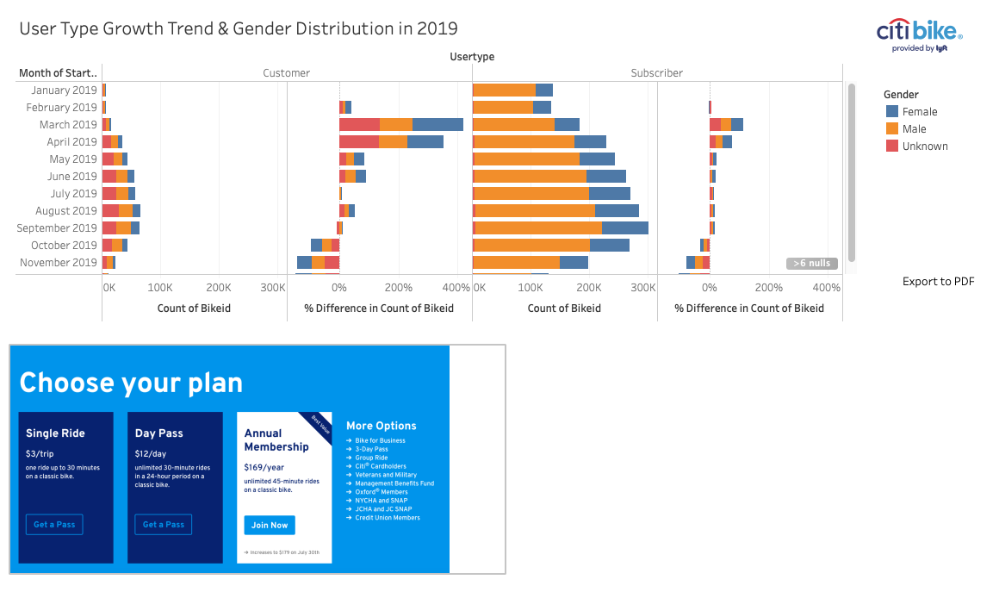

# Citi Bike Analytics

## Background

Since 2013, the Citi Bike Program has implemented a robust infrastructure for collecting data on the program's utilization. Through the team's efforts, each month bike data is collected, organized, and made public on the [Citi Bike Data](https://www.citibikenyc.com/system-data) webpage.

However, while the data has been regularly updated, the team has yet to implement a dashboard or sophisticated reporting process. City officials have a number of questions on the program, so your first task on the job is to build a set of data reports to provide the answers.

**My task is to aggregate the data found in the Citi Bike Trip History Logs and find two unexpected phenomena.** 

### Program Overview 

* Please find program info here: [New York Citi Bike](https://en.wikipedia.org/wiki/Citi_Bike) Program. 

* Please find the pulic datasets on the [Citi Bike Data](https://www.citibikenyc.com/system-data) webpage.

## Tableau Public 

* Please find the analysis dashboard and story on this [Tableau Challenge](https://public.tableau.com/views/TableauChallenge_15957306241710/Story1?:language=en&:display_count=y&:origin=viz_share_link) webpage. 

## Analysis

This report shows some unexpected phenomena based on the city bike data in 2019. 

* The number of bike trips for subscribers in these January, February and December was at least 22 times more than the number of trip for customers. 
* The average trip duration (in seconds) is longest during midnight hours from 1am to 4am.
* Male riders made twice as many trips as female riders. 

## Annual Rider Growth Trend

The number of trips and trip durations drastically increased during summer months, starting from March to Ocotober 2019. The peak of the number of trips was reached in September. When the user type is broken down into customers and subscribers, the overall trend of the total trip numbers remains the same with the peak in August and September. In contrast to subscribers, the number of trips for customers or visitors, is the lowest in January, February and December, which are usually the coldest months in New York. However, the number of trips for subscribers or annual memberhip holders in these 3 months was at least 22 times more than the number of trip for customers.

## Most Popular Stations

For subscribers, the most popular stations are evenly spread out in different neighborhoods in Manhattan. The most popular station is [Pershing Square North](https://en.wikipedia.org/wiki/Pershing_Square,_Manhattan), where is in front of the Grand Central Terminal that provides transportation for thousands of commuters to the New York City every day. 

For travelers, the most popular stations are those locations surrounding the Central Park and along the Hudson River. The most popular station for travelers is the Central Park and 6th Ave, where is the entrance of the Central Park. We can assume here's where travelers rent the bikes and start their biking trips in the Central Park. Seasonal changes didn't affect this popularity ranking. 

## Peak Hours and Average Trip Durations

The rush hours are 8am in the morning and 5pm and 6pm in the afternoon, which aligns with regular full-time job schedules. Not a suprise, the rush hours are not different in Summer or in Winter. 

The average trip durations are longest from 1am to 4am, which is unexpected that bike riders would make longer trips after midnight. 

## Gender Difference

In 2019, male bike riders were more than twice as many as female bike riders. In addition, the monthly changes in female ridership number are similar to the overal trend that was on the rise since March and then started dropping in October. 

## Most Used Bikes

Bike ID 29097 made the most trips in 2019, where most trips were made by subscribers. The second most used bike is ID 19465, however, most trips were made by traverlers. 
